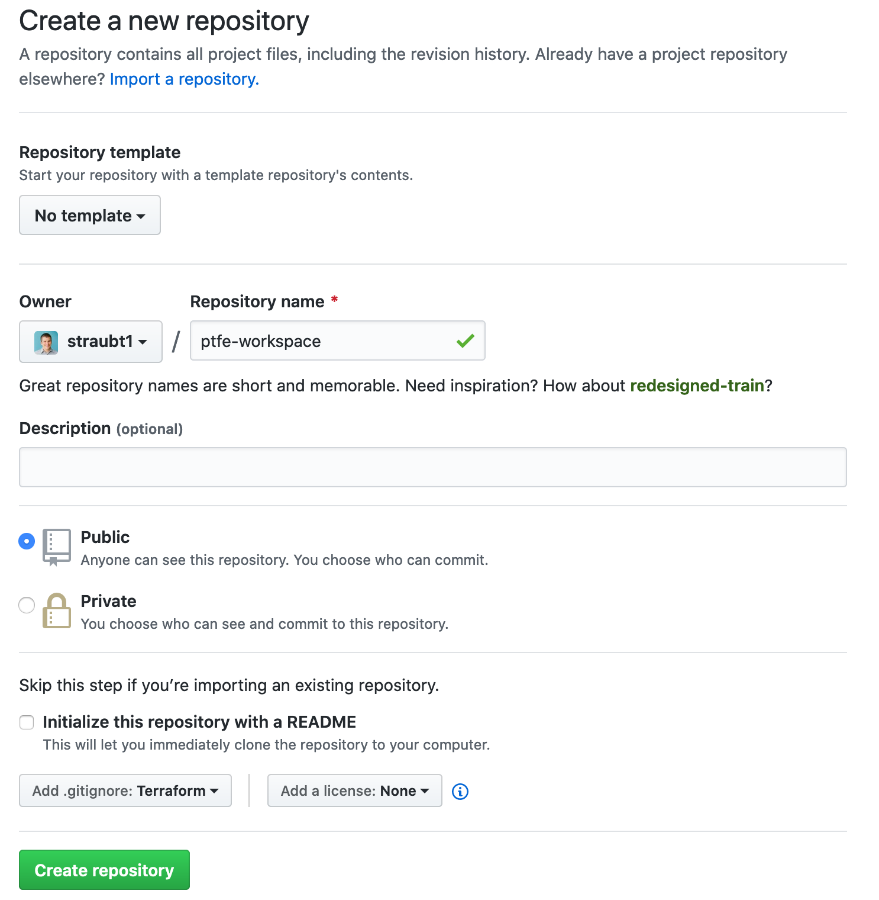

# Terraform Enterprise - Workspaces

## Expected Outcome

In this challenge, you will create a repository, a TFE workspace, and link them together.

## How to

### [GitHub] Create a new github repository

Login to github and create a new repository by navigating to <https://github.com/new>.

Use the following settings:
- `name` = "terraform-workspace"
- Public repo
- Check "Initialize this repository with a README"
- Add `.gitignore` of type "Terraform"



Once created, clone the repository to your local machine.

### [TFE] Create a Workspace

Login to TFE and click the "+ New Workspace" button.

Select the VCS Connection to github.


In the repository section:

* Click link "Advanced Options" to show all
* Enter the name of the repository you created above
* Set the working directory to "/first-workspace"


### [Local] Update your repository

In your repository, create a folder called "first-workspace/" and then create a `main.tf` file with the following contents:

```hcl
variable "name_count" {
  description = "The number of names to produce."
  default     = 3
}

variable "name_prefix" {
  description = "The prefix string to start each name with."
  default     = null
}

resource "random_pet" "names" {
  count  = var.name_count
  prefix = var.name_prefix
}

output "names" {
  value = random_pet.names.*.id
}
```

Commit the changes through the GitHub UI.

*Optional to do this through a CLI.*
```sh
git add *
git commit -m "My First Workspace"
git push origin master
```

### [TFE] Queue a Plan

Back in your TFE Workspace, navigate to your workspace.


Verify the plan succeeded, it should look something like this:


Discard the the Run.

### [TFE] Workspace Variables

Go to the "Variables" tab.

Enter the following variables in the Terraform Variables section:

- "name_count" = <a number between 1 and 10>
- "name_prefix" = "<insert your username>"


### [TFE] Apply

Back in your TFE Workspace, queue another plan.

Once the plan succeeds you should see a different output than the first plan.

Confirm the plan, by clicking "Confirm & Apply".

Verify the outputs are as expected.


### Extra Credit

1. Find the workspace id (hint: it will start with "ws-").
2. Commit a change to source control, what happens?
3. Queue two plans, can you apply them out of order?
4. Check out the state file and explore version differences.

## How To (Phase 2)

### [Local] Update your Repository

In your repository, create a folder called `app-web` and then create a `main.tf` file with the following contents:

```hcl
provider "google" {
  credentials = var.creds
  project = var.project
  region  = var.region
  zone    = var.zone
}

resource "google_compute_network" "vpc_network" {
  name = "terraform-network"
}

resource "google_compute_instance" "web" {
  count        = var.num_webs
  name         = "${var.name}-${count.index + 1}"
  machine_type = "f1-micro"
  zone         = var.zone

  boot_disk {
    initialize_params {
      image = var.image
    }
  }
  network_interface {
    network = google_compute_network.vpc_network.name

    access_config {

    }
  }
  tags = [var.identity,"yourname","env1"]
}
output "public_ip" {
  value = google_compute_instance.web[*].network_interface[0].access_config[0].nat_ip
}
```
Commit the changes in GitHub.

In your `app-web` folder create a `variables.tf` file with the following contents:

```hcl
variable "project" {}
variable "zone" {}
variable "region" {
  default = "us-east1"
}
variable "image" {}
variable "identity" {}
variable "name" {}
variable "num_webs" {}
variable "creds" {}
```

Commit the changes in GitHub.

### [TFE] Create a Workspace

Login to TFE and click the "+ New Workspace" button.

Create another workspace, similar to above, with the following changes:

* Name the workspace `app-web`
* Use the same repository (ptfe-workspace)
* Point the workspace to the repository working directory of `/app-web`

### [TFE] Add Variables
Enter the following into the Variables section.  Your values will differ, but use those values that were in your `terraform.tfvars` file from previous labs.

```sh
project = "terraformtraining1"
zone = "us-east1-b"
image = "debian-cloud/debian-9"
identity = "rpt"
name = "rpt"
num_webs = 3
creds = "<Contents of account.json for GCP>"
```


### [TFE] Plan and Apply

Queue another plan, if all looks good, Apply!

### [TFE] Destroy

In your 'app-web' Workspace, navigate to the Variables page.

Add a new Environment Variable: "CONFIRM_DESTROY = 1"

Click the Workspace "Setting" menu -> "Destruction and Deletion"


Click the "Queue destroy plan" to queue a destructive plan.


If the destroy plan looks good, apply it.


## Resources

[Random Terraform Provider](https://registry.terraform.io/providers/hashicorp/random)
