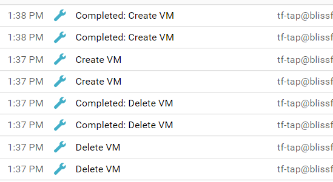
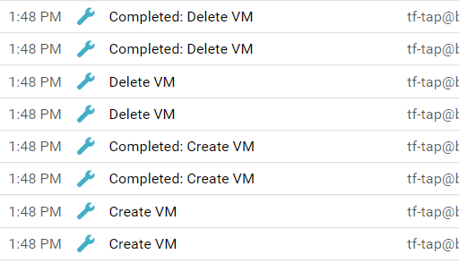

# Lab 6: Lifecycles

Duration: 15 minutes

This lab demonstrates how to use lifecycle directives to control the order in which Terraform creates and destroys resources.

- Task 1: Use `create_before_destroy` with an instance rename
- Task 2: Use `prevent_destroy` with an instance


## Task 1: Use `create_before_destroy` with an instance rename

When you rename a Google Compute Instance, terraform will reprovision the resource (delete and then create a new instance).  We can leverage `create_before_destroy` to override that default behavior

### Step 6.1.1: Rename your Google Compute Instance(s)

Open your `server\server.tf` file and add the suffix _renamed_ to the value for `name` as shown below:

```hcl
resource "google_compute_instance" "web" {
  count        = var.num_webs
  name         = "${var.name}${count.index + 1}renamed"
  machine_type = "f1-micro"
```

Run a `terraform apply` to see Terraform will _replace_ your instances by first deleting them and then recreating them:

```shell
terraform apply
```

```text
Resource actions are indicated with the following symbols:
-/+ destroy and then create replacement

Terraform will perform the following actions:

  # module.server.google_compute_instance.web[0] must be replaced
  ```

Answer `yes` to proceed with the replacement of the instances.

The Google Cloud admin console shows that the instances have been deleted first, and then recreated (bottom to top):



### Step 6.1.2: Use `create_before_destroy` and rename the instances again

Add a `lifecycle` configuration to the `google_compute_instance` resource. Specify that this resource should be created before the existing instance(s) are destroyed.  Additionally, rename the instance(s) again, by removing the suffix _renamed_, added in the previous step.

```hcl
resource "google_compute_instance" "web" {
  count        = var.num_webs
  name         = "${var.name}${count.index + 1}"
  # ...

  lifecycle {
    create_before_destroy = true
  }
}
```

Now provision the new resources with the improved `lifecycle` configuration.

```shell
terraform apply
```

```shell
Resource actions are indicated with the following symbols:
+/- create replacement and then destroy

Terraform will perform the following actions:

  # module.server.google_compute_instance.web[0] must be replaced
+/- resource "google_compute_instance" "web" {
```

The Google Cloud admin console reflects this behavior as well (bottom to top):



## Task 2: Use `prevent_destroy` with an instance

We'll demonstrate how `prevent_destroy` can be used to guard an instance from being destroyed.

### Step 6.2.1: Use `prevent_destroy`

Add `prevent_destroy = true` to the same `lifecycle` stanza where you added `create_before_destroy`.

```hcl
resource "google_compute_instance" "web" {
  
  # ...

  lifecycle {
    create_before_destroy = true
    prevent_destroy = true
  }
}
```

Attempt to destroy the existing infrastructure. You should see the error that follows.

```shell
terraform destroy -force
```

```
Error: Instance cannot be destroyed

  on server\server.tf line 32:
  32: resource "google_compute_instance" "web" {

Resource module.server.google_compute_instance.web[0] has
lifecycle.prevent_destroy set, but the plan calls for this resource to be
destroyed. To avoid this error and continue with the plan, either disable
lifecycle.prevent_destroy or reduce the scope of the plan using the -target
flag.
```

### Step 6.2.2: Destroy cleanly

Now that you have finished the steps in this lab, destroy the infrastructure you have created.

Remove the `prevent_destroy` attribute.

```hcl
resource "google_compute_instance" "web" {

  # ...

  lifecycle {
    create_before_destroy = true
    # Comment out or delete this line
    # prevent_destroy = true
  }
}
```

Finally, run `destroy`.

```shell
terraform destroy -force
```

The command should now succeed and your resources should be destroyed.
